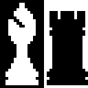

	

# pdchess2

pdchess2 : Portable Didactic Chess, incarnation number 2.

A rudimentary chess application with a command-line interface.

## History

- I witnessed the University of Waterloo host a tournament of Othello (Reversi)-playing programs in 1992; these programs played each other by sending game data over the Internet.
- After creating my own rudimentary Othello-playing program in C, I chose chess as the next problem domain to tackle. The result was [incarnation number 1](https://github.com/tom-weatherhead/pdchess1) of pdchess, which was written in C in 1993. I began the project during my university exams in April. This version had a console interface. I started developing it on the univerity's Unix computers, then e-mailed the source code to my e-mail address at Digital Equipment of Canada in Ottawa, where I worked during the summer of 1993. At Digital, I ported the code to compile and run on the VAX/VMS operating system, and I continued development. In August 1993, I e-mailed the source code back to Waterloo. Just before finishing my final term in April 1994, I copied the source code to a 3.5-inch floppy and took it with me.
- During the summer of 1994, I modified the code to work on my brand-new computer (an Intel 80486SX PC clone running Windows 3.1, with 640 KB + 3072 KB of RAM and a 360 MB hard drive, plus 3.5-inch and 5.25-inch floppy drives) via Borland Turbo C++ 3.1. I created a GUI for pdchess using Turbo C++'s OWL (Object Windows Library) framework. (OWL was analogous to Microsoft's MFC.)
- Incarnation number 2 of pdchess was written in C++ in 2002, after I had read Bjarne Stroustrup's book on the language.
- [Incarnation number 3](https://github.com/tom-weatherhead/pdchess3) of pdchess was written in Typescript in Beijing, China in February and March 2020, during the COVID-19 coronavirus pandemic.
- pdchess is also known to some as 'partly done chess'. :-)

## License
[MIT](https://choosealicense.com/licenses/mit/)
